# Healfoai / Calorie Lens AI

Mobile-first calorie tracking application built with Flutter, FastAPI, and a benchmark-driven computer vision workflow.

## What This Repository Is

This folder is a public-facing showcase surface for the Healfoai project.

It is designed for:

- recruiters who want to understand the product quickly
- ATS-friendly project scanning
- portfolio presentation with concrete screenshots and technical highlights

The main development repository includes the full monorepo, while this showcase surface focuses on product explanation.

## Product Summary

Healfoai combines:

- photo-based food analysis
- daily calorie and macro tracking
- profile-based nutrition targets
- guest mode and offline snapshot reads
- AI coach entry points

Core stack:

- Flutter mobile app
- FastAPI backend
- SQLAlchemy + Alembic
- PyTorch / YOLO / ONNX ML workflow

## Metrics Snapshot

Current baseline ML signals from the first notebook runs:

### Detector Baseline

- Model: `YOLOv8n`
- Detector classes: `1` (`food`)
- Precision: `0.947`
- Recall: `0.852`
- mAP50: `0.948`
- mAP50-95: `0.723`
- Validation context: `4702` images / `4734` instances

### Classifier Baseline

- Model: `EfficientNet-B0`
- Observed class count: `36`
- Stage 1 best validation accuracy: about `0.526`
- Stage 2 best validation accuracy: about `0.831`
- Late-stage training accuracy: about `0.964`

These are research baselines, not final production metrics. The rollout policy in the main project remains benchmark first, then shadow telemetry, then gated promotion.

## Screenshots

### Dashboard

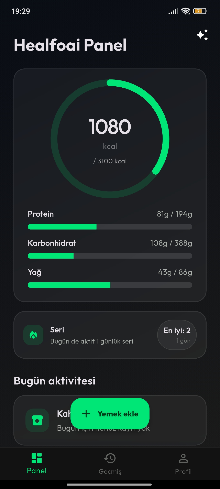

### Add Meal

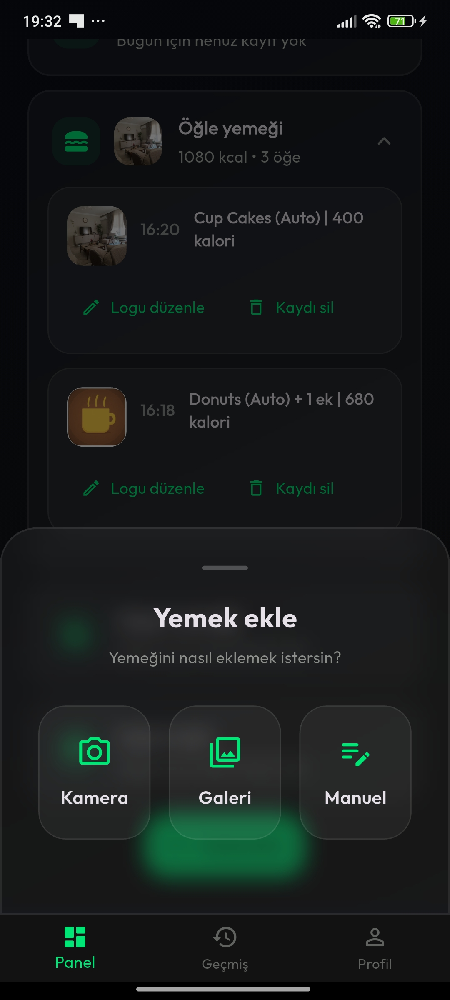

### Image Processing Flow

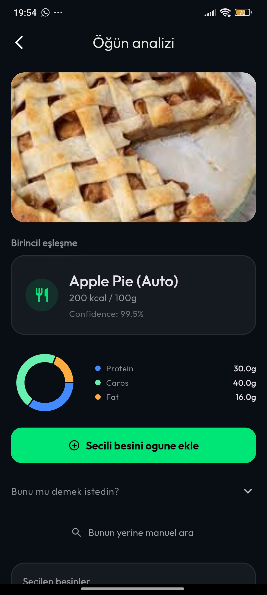

### Analysis Result

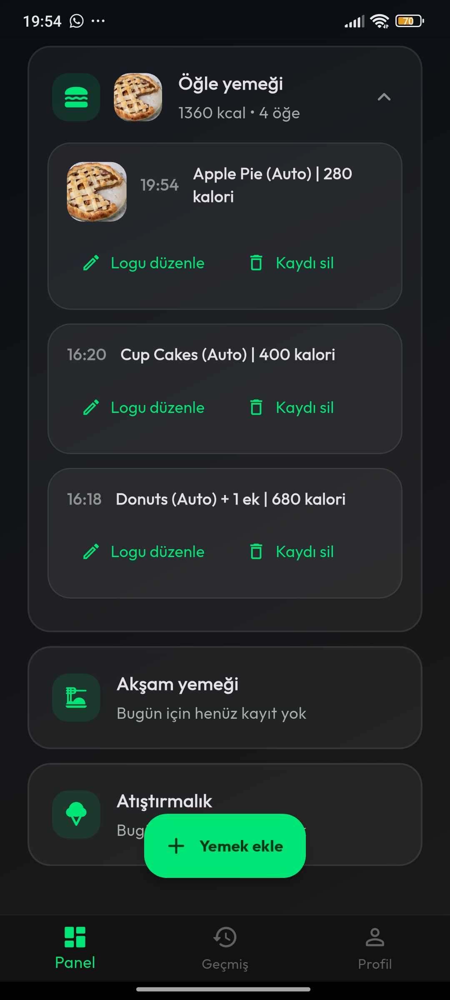

### History

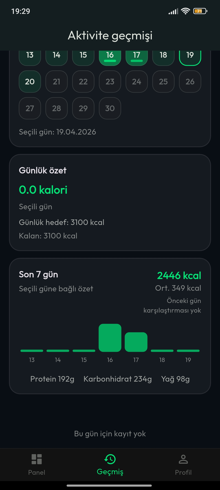

### Profile And Targets

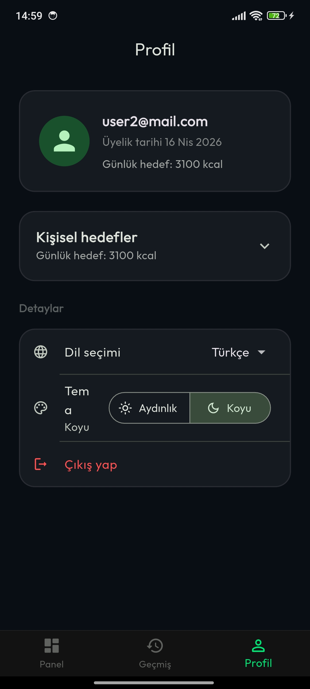

### AI Coach

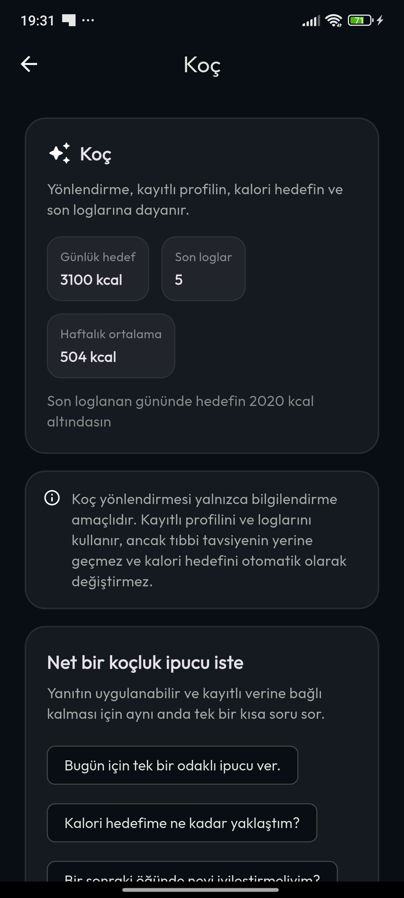

### Light Theme

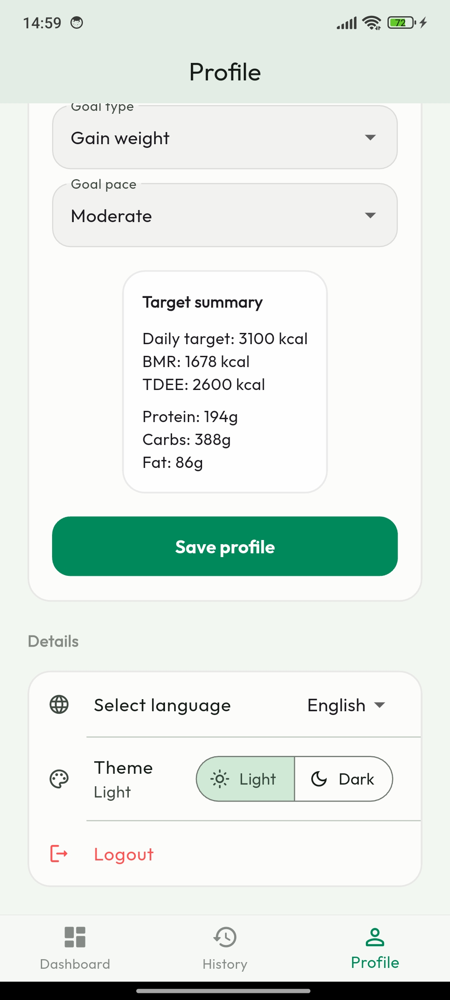

### Coach Detail

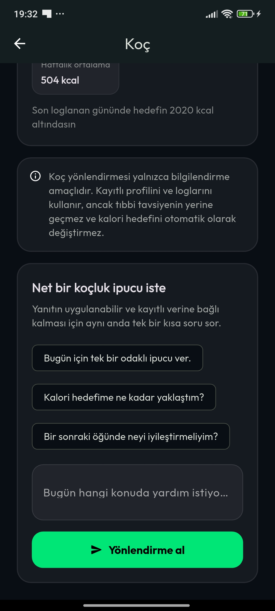

### Coach Loading State

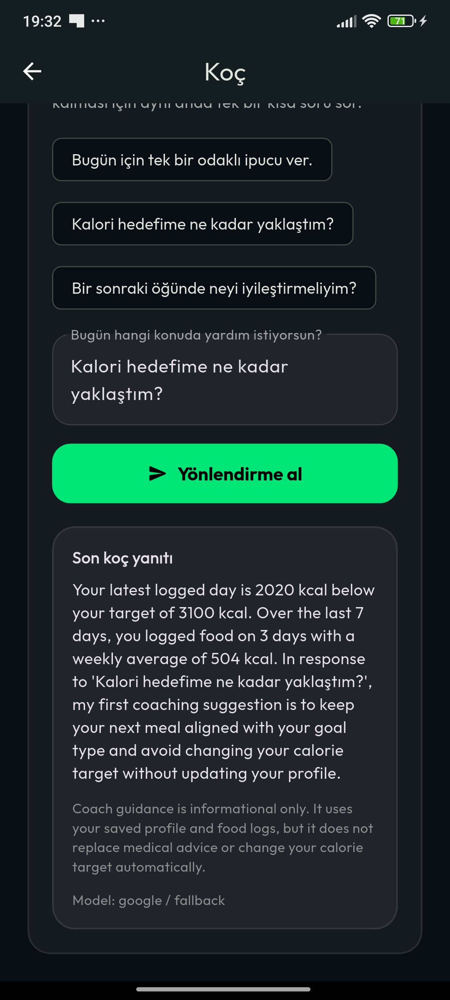

### Sample Food Analysis

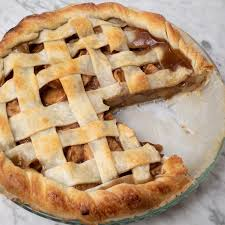

### Dashboard Detail

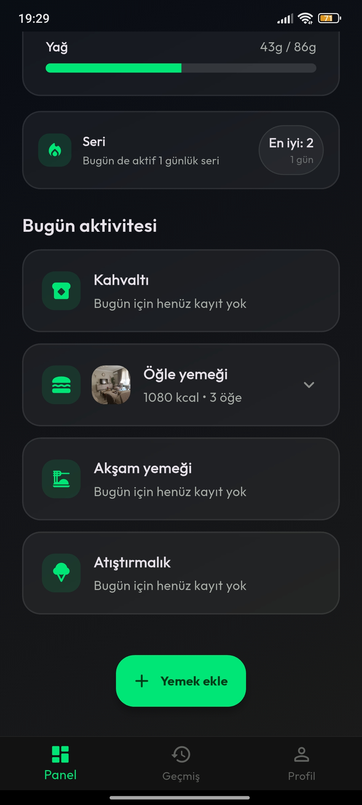

### History Detail

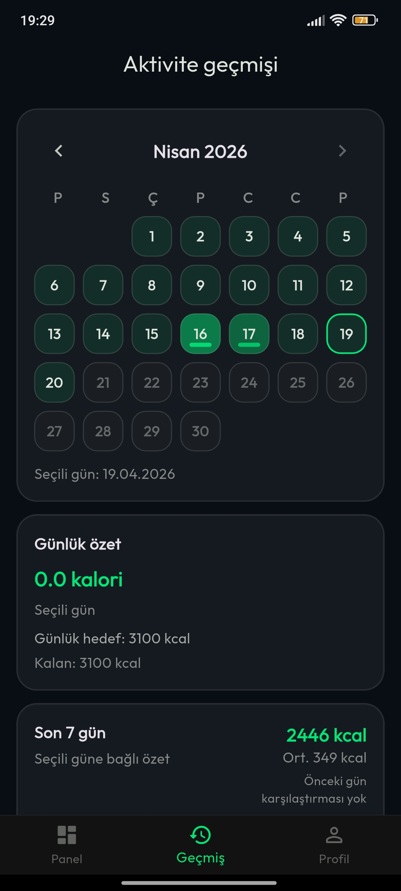

### Image Processing Flow Step 2

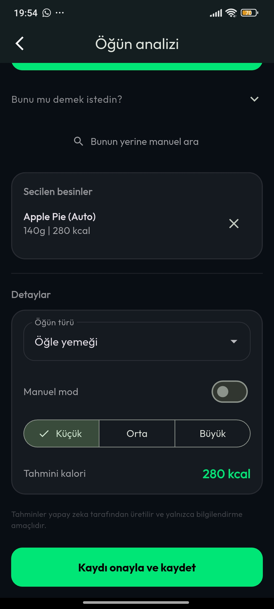

### Profile Form

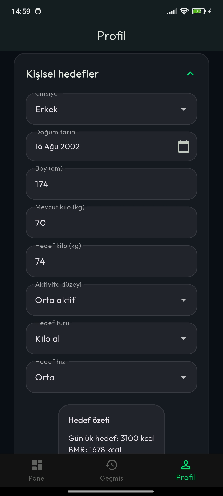

### Profile Settings

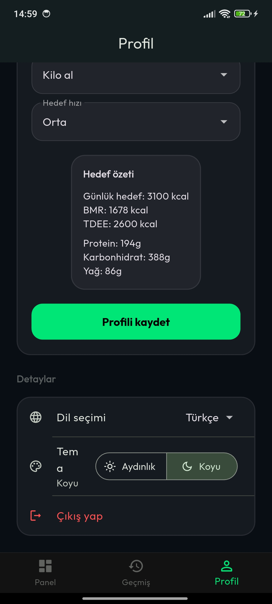

## Key Product Features

- Camera, gallery, and manual meal entry flows
- Multi-item meal save contract
- Dashboard with calorie ring, macro progress bars, and streak summary
- History with editable meal logs
- Profile-driven calorie and macro target planning
- Guest-safe planner and offline snapshot reads
- AI coach entry point from the dashboard

## Technical Highlights

- Monorepo architecture with clear mobile / backend / ML boundaries
- Backend-owned calorie and macro target calculations
- Feature-flagged inference rollout discipline
- Shadow telemetry before model promotion
- Reproducible ML dataset manifests and training entrypoints
- Catalog mapping layer between model labels and food records

## ML Workflow Snapshot

The project currently distinguishes between:

- a live legacy ONNX classifier path
- an exported classifier path under evaluation
- a staged detector -> crop -> classifier pipeline planned behind benchmark gates

This benchmark-first approach reduces risk before runtime promotion.

See [docs/metrics.md](docs/metrics.md) for the fuller model snapshot and interpretation.

## Recruiter-Friendly Project Framing

Suggested short description:

> Built a Flutter + FastAPI calorie tracking application with AI-assisted food recognition, nutrition target planning, offline-friendly flows, and a benchmark-driven ML rollout pipeline.

## My Role

Suggested wording:

- Designed and implemented the mobile, backend, and ML workflow surface
- Built the benchmark-driven model promotion and telemetry approach
- Developed food logging, nutrition target planning, and offline-capable user flows

## Folder Map

- `assets/screenshots/`: showcase images
- `docs/metrics.md`: current model metrics summary
- `docs/architecture-summary.md`: short technical walkthrough
- `docs/cv_blurb.md`: CV / LinkedIn / portfolio wording
- `docs/screenshot-checklist.md`: screenshot selection and refresh guide
